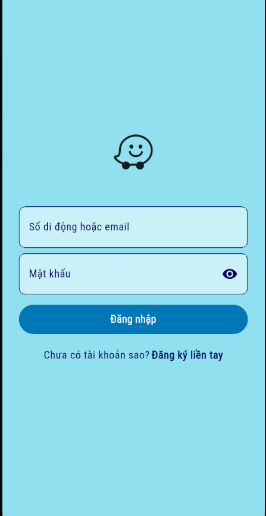
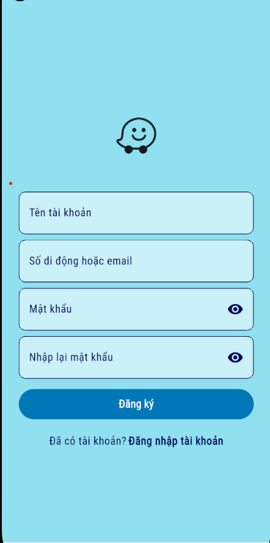
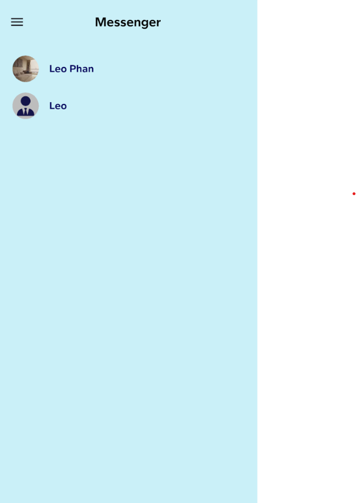
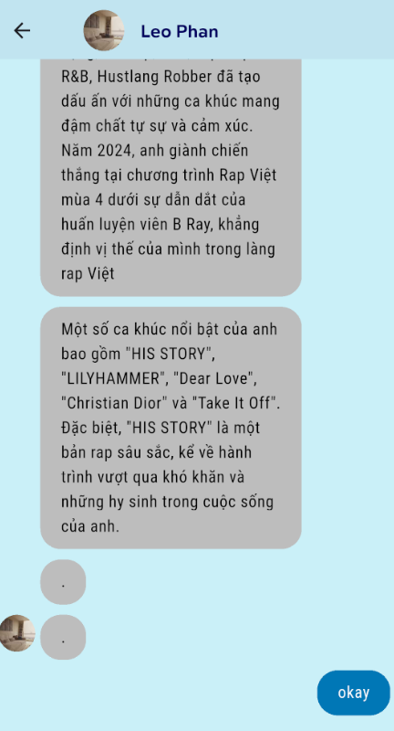
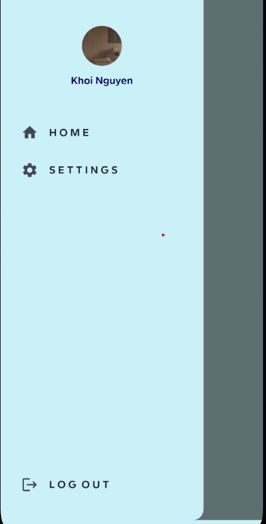
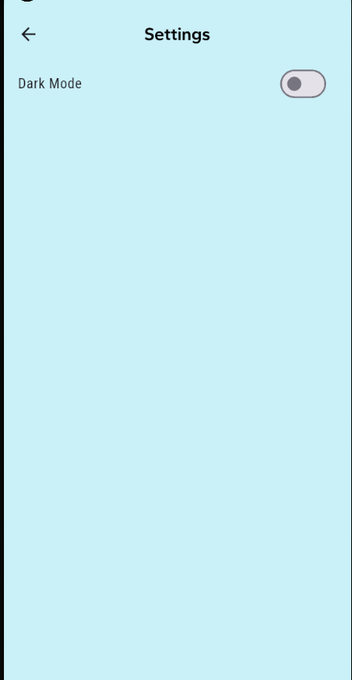
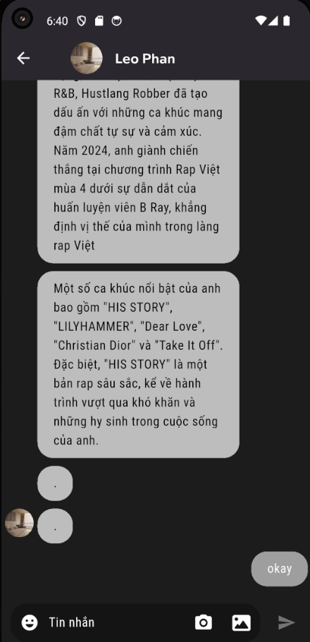
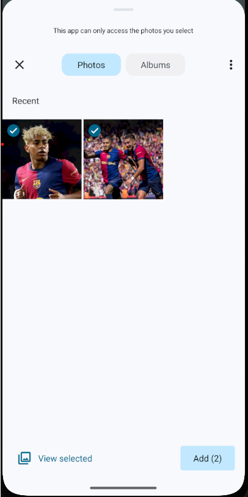
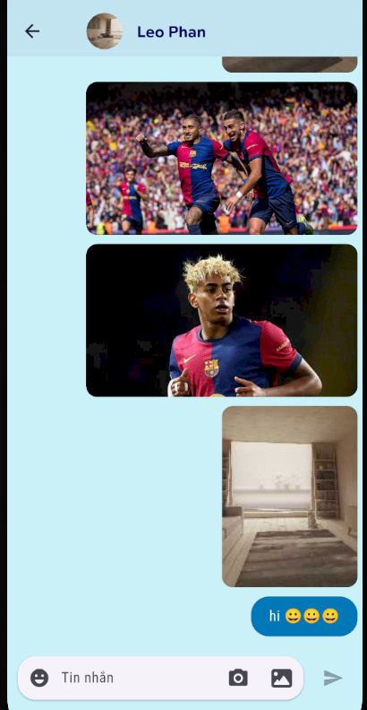

# 🗨️ Leo Chat App 
A full-featured real-time chat application built with Flutter and Firebase, supporting both private and group messaging. Designed with a clean MVVM architecture and powered by Riverpod for scalable state management. The app integrates push notifications via Firebase Cloud Messaging, with a custom Node.js + Express.js backend to trigger notifications through RESTful APIs.

## 🚀 Tech Stack

**Frontend:** Flutter (Dart), Riverpod, MVVM

**Backend:** Node.js, Express.js, Firebase Cloud Messaging

**Database:** Firebase Firestore
**Storage:** Firebase Storage
**Authentication:** Firebase Auth

## 📱 App UI Screenshots

### 🔐 Authentication

| Login | Register |
|-------|----------|
|  |  |

---

### 🏠 Main Interface

| Home | Chat | Drawer |
|------|------|--------|
|  |  |  |

---

### ⚙️ Settings & Theme

| Settings | Dark Theme |
|----------|------------|
|  |  |

### 🖼️ Send image, multiple images and emoji

| Settings | Dark Theme |
|----------|------------|
|  |  |
